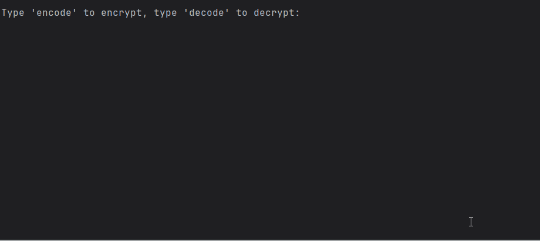

# Caesar Cipher CLI

## Overview

A simple command-line tool to **encode** and **decode** messages using the classic Caesar cipher. It shifts letters through the alphabet while keeping punctuation, numbers, and spaces unchanged. Includes an ASCII art logo for a fun terminal experience.

## Demo



## How It Works

The script rotates each alphabetical character by a user-provided shift value. Characters outside `a–z` are preserved. Negative and large shifts are normalized (wrapped) across the alphabet.

**Key features:**

* Encode or decode interactively
* Preserves spaces, punctuation, and numbers
* Handles any shift (wraps using modulo 26)
* Lowercases input to keep things simple
* ASCII art banner on start

## How to Run

**Requirements:** Python 3.8+

1. **Project structure**

   ```
   your-project/
   ├─ logo.py          # contains: logo = """...ASCII art..."""
   └─ main.py          # the Caesar cipher script
   ```

2. **Add the ASCII logo**

   * In `logo.py`, define a variable named `logo` with your ASCII art (as shown in your snippet).

3. **Run the app**

   ```bash
   python main.py
   ```

   Follow the prompts:

   * `encode` to encrypt, `decode` to decrypt
   * Enter your message
   * Enter a shift number (e.g., 5)

4. **Example session**

   ```
   Type 'encode' to encrypt, type 'decode' to decrypt:
   encode
   Type your message:
   hello, world!
   Type the shift number:
   5
   Here's the encode result: mjqqt, btwqi!
   Type 'yes' if you want to go again. Otherwise type 'no'
   no
   Good Bye
   ```

> Tip: Non-alphabet characters are left as-is. Shifts larger than 26 (or negative) still work everything wraps around the alphabet.

## Resources

* ASCII Art for banners: [https://ascii.co.uk/art](https://ascii.co.uk/art)
